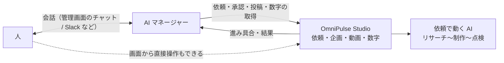

# AI マネージャー設計

人と OmniPulse Studio のあいだに立つ窓口の AI の設計。**現状: 未実装（2026-10-11）。** 管理画面の「AI マネージャー」（`/manager`）は準備中の表示だけで、何も動かさない。

関連: Decision 021（位置づけ）、Decision 002 / 010（承認は人。明示的な OK を得てから approve）、Decision 019（禁止事項と、作業中は承認・投稿を断る鍵）、Decision 020（依頼のアカウント）。

---

## 1. 位置づけ

**人と OmniPulse Studio のインターフェース**（2026-10-11 ユーザー指示）。人はマネージャーに伝え、マネージャーが Studio を動かし、結果を人に伝える。動画を作るのはこれまでどおり依頼で動く AI（工程ごとに「AI 連携」で選んだ AI）で、マネージャーは自分では作らない。

今ある画面（作成する・企画・動画など）は残す。マネージャーは主な窓口だが唯一ではなく、人は画面から直接操作することもできる。

## 2. やりとりの場所

両方を用意する（2026-10-11 ユーザー決定）。

1. **管理画面の中のチャット**（先に作る）: `/manager` に会話の場所を置く。構成案の相談・動画編集と同じく、発言を DB に残し、AI の返事は別プロセスで埋める作りを想定。
2. **外のチャット**（あとで）: Slack など。話しかけるのも、マネージャーからの知らせ（動画ができた・失敗した・数字が出た）も、そこに届く。外のサービスとの連携（認証・受け口）が別に要る。

どちらの場所でも、会話と判断の記録は Studio の DB に1か所で持つ。

## 3. 任せる予定の仕事

| 仕事 | 内容 | 使うもの |
| :--- | :--- | :--- |
| 話を聞いて依頼にする | 人の話（目的・お題・本数など）から、アカウント・お題・構成案・リサーチ手法・禁止事項を選んで依頼を出す | `AgentJob` を作る処理（`createVideoJob` と同じ。同時に動かすのは全体で1件） |
| 進み具合と結果を伝える | できた動画、失敗とやり直し、投稿した動画の数字と分析を知らせる | `AgentJob`、`data/jobs/<id>/log.jsonl`、企画・動画 |
| 判断が要るところで聞く | 動画（プレビュー・台本・出典）を見せて承認・投稿してよいか聞き、OK をもらったら実行する。構成案・リサーチ手法の改善案を出す | 承認・投稿の処理（`approveProject` / `publishProject` と同じ） |
| 数字を取得して分析する | YouTube の数字を取得し、分析して知見を貯める（2026-10-11 ユーザー決定） | `collectYouTubeMetrics` / `analyzeProject` と同じ処理 |
| 自分から提案する | 次に作る動画や、数字から分かったことを提案する | 知見、構成案ごとの成績 |

## 4. 判断は人が行う

- **承認・投稿・公開は、人の明示的な OK を受けて、マネージャーが代わりに実行する**（2026-10-11 ユーザー決定。Decision 010 の「プレビューを見せて明示的な OK を得てから approve」と同じ形）。マネージャーが自分の判断で行うことはない。
  - 実行するときは、OK した人の発言（会話の記録）を必ず紐づける。紐づく OK がなければ実行しない（仕組みで止める。4.2）。
  - 投稿は今と同じく YouTube に非公開で上げ、公開は YouTube Studio で人が行う。
- 構成案・リサーチ手法・禁止事項の変更は、マネージャーは改善案を出すまで（2026-10-11 ユーザー了承。「一旦それでいい」ので、運用しながら見直す）。
- 数字の手入力（`metrics:record`）は人が見た数字に限る（AI に数字を作らせない）。
- 依頼で動く AI（動画を作る側）は、これまでどおり承認・投稿・数字の取得はできない。

## 5. 動かすために足りないもの

1. **会話の場所**: 管理画面のチャット（会話のテーブルと、返事を埋める別プロセス）。あとで外のチャットの連携。
2. **人の OK の記録と、それによる実行の制限**: 承認・投稿は「OK した発言」が紐づくときだけ実行できるようにする。今の CLI の鍵（作業中は承認・投稿などを断る。Decision 019）とは別に、マネージャー用の入口を作る。
3. **数字の取得と分析をマネージャーに許す**: 今の `metrics:collect` / `analyze` は人の操作で、AI からは実行できない。マネージャーにだけ許し、動画を作る側の AI には許さない。
4. **上限と停止**: 1日に作る本数・時間帯の上限と、すぐ止めるスイッチ（`AppSetting` に持つ想定）。
5. **自分から動く仕組み**: 決まった時間や、依頼の完了・数字の更新をきっかけに起動して、知らせたり提案したりする。`/api/cron/autonomous-cycle`（`INTERNAL_API_TOKEN` 必須。今は 501）を入口にする想定（`autonomous-cron.md`）。
6. **マネージャー自身を動かす AI**: 「AI 連携」の用途に「AI マネージャー」を足す。会話しながら Studio を操作するため、操作をツールとして渡せる AI が要る。

## 6. 未決事項

- 自分から動くきっかけ（時刻・依頼の完了・数字の更新など）。
- 外のチャットに何を使うか（Slack・LINE など）。

### 決まったこと（2026-10-11）
- 位置づけは人と Studio のインターフェース。今ある画面は残す。
- やりとりは管理画面のチャットと外のチャットの両方（管理画面が先）。
- 承認・投稿は、人の明示的な OK を受けてマネージャーが代わりに実行する。
- 構成案・リサーチ手法・禁止事項の変更は案を出すまで（一旦この形）。
- 数字の取得と分析はマネージャーに任せる。
