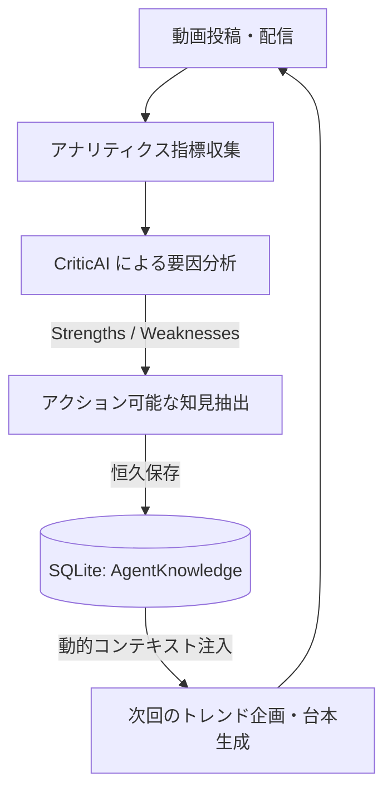

# 自律PDCAループ & CriticAI ナレッジ蓄積アーキテクチャ (analytics-pdca)

OmniPulse AI Studio における、動画投稿後のパフォーマンス検証から要因分析、およびチャンネル固有の改善ルール（AgentKnowledge）の自律的蓄積と次回台本への自動適用パイプラインの設計仕様。

---

## 1. 概要とアーキテクチャ目的

従来の動画制作AIは「一回生成して終わり」であり、過去の動画のウケが良かったか悪かったかの教訓を学習できません。
OmniPulse AI Studio では、**自律PDCAループ（CriticAI）** を実装し、以下のサイクルをローカル環境で自律完結させます。



---

## 2. コアコンポーネント

| コンポーネント | ファイルパス | 責務 |
| :--- | :--- | :--- |
| **diagnosePerformance** | `src/lib/agents/performanceDiagnosis.ts` | 実測値から計算できる事実だけで診断文と知見を作る純粋関数（画面側の表示にも使う） |
| **CriticAgent** | `src/lib/agents/criticAgent.ts` | `diagnosePerformance` の呼び出しと、知見の `AgentKnowledge` への保存 |
| **Analytics API** | `src/app/api/analytics/route.ts` | アナリティクス指標のDB永続化および、CriticAIが抽出したナレッジの `AgentKnowledge` 保存処理 |
| **AnalyticsView** | `src/components/AnalyticsView.tsx` | 指標カード、プラットフォーム別比較、要因分析レポート、ナレッジベース一覧の統合表示 |
| **AgentKnowledge DB** | `prisma/schema.prisma` (SQLite) | アカウントごとに完全分離された学習ルール永続化テーブル |

---

## 3. 分析・知見抽出ロジック (`CriticAgent`)

### 3.1 原則
- **実測値だけを使う。** 実測値が無いプロジェクトは分析しない（API は 400 を返す）。架空の数値で補完しない（Decision 009）。
- **計算で言える事実だけを書く。** 「フックが効いた」「字幕で維持率が上がった」のような、測っていない因果は書かない。因果の推定は LLM 導入後の課題とする。

### 3.2 実測値の登録 (`POST /api/analytics`)
```json
{
  "projectId": "...",
  "applyToKnowledge": true,
  "metrics": {
    "platforms": [
      { "platform": "youtube", "views": 1500, "likes": 40, "shares": 3, "comments": 5, "engagementRate": 3.2, "retentionRate": 48.5, "topComment": "任意" }
    ]
  }
}
```
- `metrics` を渡すと、**送ったプラットフォームの** `AnalyticsMetric` を置き換えて保存する。他のプラットフォームの値は残す（YouTube は API 取得、他は手入力と経路が混在するため）。
- 配信済み（`PublishLog.status = "published"`）でないプラットフォームの値は受け付けない。
- `retentionRate` は分からなければ省略する（null として保存。0 を入れない）。平均維持率は、取得できた媒体だけで再生数加重平均する。
- `metrics` を省略すると、DB に登録済みの実測値で再分析する。
- 本体は `src/lib/services/analyticsService.ts`。エージェント CLI（`metrics:record` / `analyze`）も同じ処理を使う。

### 3.2.1 YouTube の自動取得 (`metrics:collect`)
`src/lib/analytics/youtubeMetrics.ts` が取得する。
- 再生数・高評価・コメント: YouTube Data API（`videos.list` の statistics）。
- 平均視聴率（`averageViewPercentage`）・シェア: YouTube Analytics API。反映まで1〜2日かかり、取れない間は維持率 null・シェア 0 として記録する。
- エンゲージメント率 = (高評価 + コメント + シェア) / 再生数。
- 知見の保存先アカウントは、リクエストの値ではなくプロジェクトの所属アカウントから決める。

### 3.3 診断内容
1. **サマリー**: 総再生数と平均視聴維持率（再生数で加重平均）。
2. **Strengths / Weaknesses**: エンゲージメント率が最も高い／低いプラットフォーム。
3. **知見（Actionable Knowledge）**:
   - 総再生数が 1,000 回未満なら保存しない（偏りが大きいため）。
   - カテゴリは `topic`、信頼度は再生数に応じて 0.3〜0.8 に留める（単発動画の観測値のため）。

## 4. データモデル (`AgentKnowledge`)

```prisma
model AgentKnowledge {
  id              String   @id @default(cuid())
  accountId       String
  account         Account  @relation(fields: [accountId], references: [id], onDelete: Cascade)
  category        String   // "hook" | "tempo" | "topic" | "cta"
  ruleText        String   // 例: "【動画タイトル】実測: TikTok のエンゲージメント率 5.1% が最高、X 1.2% が最低（総再生 4,000回）"
  confidenceScore Float    // 0.0〜1.0
  appliedCount    Int      @default(0)
  createdAt       DateTime @default(now())
  updatedAt       DateTime @updatedAt
}
```

---

## 5. 次回企画・台本生成への動的プロンプト注入

企画・台本生成エージェント（TrendScout / ScriptWriter）が起動する際、現在のアカウントIDに紐づく `AgentKnowledge` を上位取得し、システムプロンプトの制約条件として動的に注入します。

```typescript
// プロンプト注入例
const knowledges = await prisma.agentKnowledge.findMany({
  where: { accountId: currentAccountId },
  orderBy: { confidenceScore: 'desc' },
  take: 5,
});

const systemPrompt = `
あなたはチャンネル「${account.name}」専属の台本AIです。
【過去の実績から導き出された必勝ルール（遵守必須）】:
${knowledges.map(k => `- [${k.category}] ${k.ruleText} (信頼度: ${k.confidenceScore * 100}%)`).join('\n')}
`;
```

運用を続けて実測の知見が溜まるほど、チャンネル固有の傾向を台本生成に反映できる。
