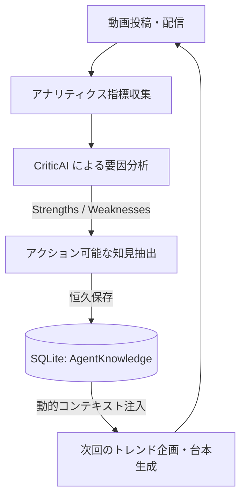

# 自律PDCAループ & CriticAI ナレッジ蓄積アーキテクチャ (analytics-pdca)

OmniPulse AI Studio における、動画投稿後のパフォーマンス検証から要因分析、およびチャンネル固有の改善ルール（AgentKnowledge）の自律的蓄積と次回台本への自動適用パイプラインの設計仕様。

---

## 1. 概要とアーキテクチャ目的

従来の動画制作AIは「一回生成して終わり」であり、過去の動画のウケが良かったか悪かったかの教訓を学習できません。
OmniPulse AI Studio では、**自律PDCAループ（CriticAI）** を実装し、以下のサイクルをローカル環境で自律完結させます。



---

## 2. コアコンポーネント

| コンポーネント | ファイルパス | 責務 |
| :--- | :--- | :--- |
| **CriticAgent** | `src/lib/agents/criticAgent.ts` | 視聴維持率・各SNSエンゲージメントから成功/失敗要因を多角診断し、定量的改善ルールを抽出 |
| **Analytics API** | `src/app/api/analytics/route.ts` | アナリティクス指標のDB永続化および、CriticAIが抽出したナレッジの `AgentKnowledge` 保存処理 |
| **AnalyticsView** | `src/components/AnalyticsView.tsx` | 指標カード、プラットフォーム別比較、要因分析レポート、ナレッジベース一覧の統合表示 |
| **AgentKnowledge DB** | `prisma/schema.prisma` (SQLite) | アカウントごとに完全分離された学習ルール永続化テーブル |

---

## 3. 分析・知見抽出ロジック (`CriticAgent`)

### 3.1 分析指標入力
- **合算総再生数**: YouTube Shorts, TikTok, Instagram Reels, X
- **平均視聴維持率**: 冒頭離脱率、中盤維持率、エンディング遷移
- **エンゲージメント率**: 高評価率、保存/シェア率、コメント感情比率

### 3.2 評価ロジック
1. **フック効果の判定**:
   - 維持率 > 70% かつ TikTok完了率高 → 冒頭1〜2秒の否定形疑問文やバウンス字幕が有効と判定。
2. **CTA・エンディング離脱の判定**:
   - 総再生数に対してシェア/保存率が低い場合 → ラストの導線切り替えタイミングに改善余地ありと判定。
3. **ルール化（Actionable Knowledge）**:
   - カテゴリ（`HOOK`, `PACING`, `CALL_TO_ACTION`, `VISUAL`）と信頼度（0.0〜1.0）を付与してテキストルール化。

---

## 4. データモデル (`AgentKnowledge`)

```prisma
model AgentKnowledge {
  id              String   @id @default(cuid())
  accountId       String
  account         Account  @relation(fields: [accountId], references: [id], onDelete: Cascade)
  category        String   // "HOOK", "PACING", "CALL_TO_ACTION", "VISUAL"
  ruleText        String   // "冒頭で『従来のやり方の否定＋最新エージェントの提示』をセットで行うと維持率が平均+18%向上。"
  confidenceScore Float    // 0.94 (94%)
  appliedCount    Int      @default(0)
  createdAt       DateTime @default(now())
  updatedAt       DateTime @updatedAt
}
```

---

## 5. 次回企画・台本生成への動的プロンプト注入

企画・台本生成エージェント（TrendScout / ScriptWriter）が起動する際、現在のアカウントIDに紐づく `AgentKnowledge` を上位取得し、システムプロンプトの制約条件として動的に注入します。

```typescript
// プロンプト注入例
const knowledges = await prisma.agentKnowledge.findMany({
  where: { accountId: currentAccountId },
  orderBy: { confidenceScore: 'desc' },
  take: 5,
});

const systemPrompt = `
あなたはチャンネル「${account.name}」専属の台本AIです。
【過去の実績から導き出された必勝ルール（遵守必須）】:
${knowledges.map(k => `- [${k.category}] ${k.ruleText} (信頼度: ${k.confidenceScore * 100}%)`).join('\n')}
`;
```

これにより、**運用を続ければ続けるほどチャンネル固有のアルゴリズム最適化が進み、動画の質と視聴維持率が自律的に向上**します。
