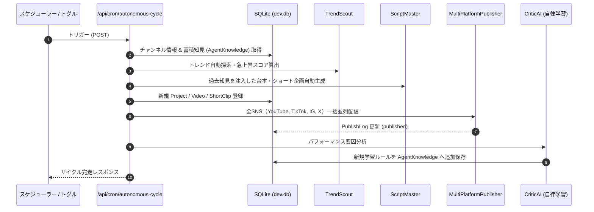

# 完全自律モード (Auto-Pilot) & 無人巡回スケジューラー設計 (autonomous-cron)

本ドキュメントでは、OmniPulse AI Studio における無人自走運用（Auto-Pilot）の技術アーキテクチャおよび自律巡回サイクル（CRON / タイマー）の仕様を定義する。

---

## 1. 概要と自律サイクルの全体フロー

人間の承認を介さず、AIエージェント自らがトレンドの検知から動画制作、マルチSNS配信、そしてアナリティクスによる自律学習までを一貫して完走するモード。



---

## 2. 実装コンポーネント

| ファイル | 責務 |
| :--- | :--- |
| **`src/app/api/cron/autonomous-cycle/route.ts`** | 定期巡回または手動トリガーを受け、リサーチから学習までの一連のパイプラインを非同期バッチ実行するコアAPI。 |
| **`src/lib/publishers/index.ts`** | YouTube, TikTok, Instagram, X の全パブリッシャーを統括し、並列配信を実行。 |
| **`src/lib/agents/criticAgent.ts`** | 投稿動画の分析からチャンネル固有ルールを抽出し、`AgentKnowledge` テーブルへ蓄積。 |
| **`src/app/page.tsx`** | ヘッダーの「Auto-Pilot」スイッチと連動し、ワンクリックで無人巡回サイクルを起動、ログ・通知をリアルタイム更新。 |

---

## 3. 本番デプロイ時のCRON設定 (Vercel Cron / GitHub Actions / Linux crontab)

### 3.1 Vercel Cron (`vercel.json`)
```json
{
  "crons": [
    {
      "path": "/api/cron/autonomous-cycle",
      "schedule": "0 19 * * *"
    }
  ]
}
```

### 3.2 Linux / Mac crontab (ローカル運用時)
```bash
# 毎日 19:00 に自律巡回サイクルを起動
0 19 * * * curl -s -X POST http://localhost:3001/api/cron/autonomous-cycle -H "Content-Type: application/json" -d '{"accountSlug":"ai-pulse-lab"}'
```
