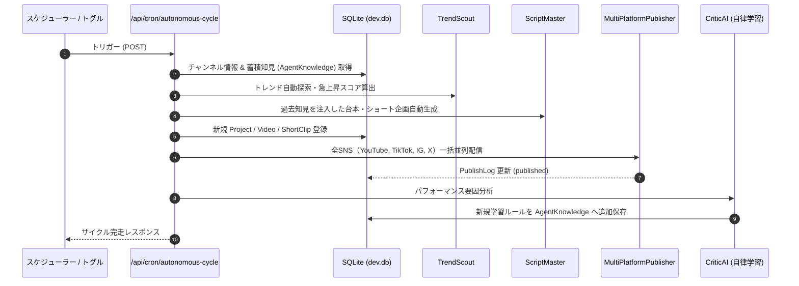

# 完全自律モード (Auto-Pilot) & 無人巡回スケジューラー設計 (autonomous-cron)

本ドキュメントでは、OmniPulse AI Studio における無人自走運用（Auto-Pilot）の技術アーキテクチャおよび自律巡回サイクル（CRON / タイマー）の仕様を定義する。

> **現状: 未実装（2026-10-09）。** `/api/cron/autonomous-cycle` は認証後に `501 Not Implemented` を返す。
> 以前の実装は、架空のトレンド・「配信済み」の架空プロジェクト・架空の再生数を DB に書き込み、それを元に学習知見まで保存していたため撤去した（Decision 009）。
> 以下のフローは、トレンド取得・台本生成・レンダリング・投稿・実測分析の各工程が実データで動くようになった後の目標設計である。

---

## 1. 概要と自律サイクルの全体フロー

人間の承認を介さず、AIエージェント自らがトレンドの検知から動画制作、マルチSNS配信、そしてアナリティクスによる自律学習までを一貫して完走するモード。



---

## 2. 実装コンポーネント

| ファイル | 責務 |
| :--- | :--- |
| **`src/app/api/cron/autonomous-cycle/route.ts`** | 定期巡回または手動トリガーを受け、リサーチから学習までの一連のパイプラインを非同期バッチ実行するコアAPI。 |
| **`src/lib/publishers/index.ts`** | YouTube, TikTok, Instagram, X の全パブリッシャーを統括し、並列配信を実行。 |
| **`src/lib/agents/criticAgent.ts`** | 投稿動画の分析からチャンネル固有ルールを抽出し、`AgentKnowledge` テーブルへ蓄積。 |
| **`src/app/page.tsx`** | ヘッダーの「Auto-Pilot」スイッチ。現状は「未実装」と通知するだけで、API は呼ばない（API はトークン必須のため、ブラウザから呼ばない設計）。 |

---

## 3. 認証

ブラウザ以外（スケジューラー）から呼ばれる API のため、`Authorization: Bearer <INTERNAL_API_TOKEN>` を必須とする。`INTERNAL_API_TOKEN` が未設定の場合は常に 401（fail closed）。

---

## 4. 本番デプロイ時のCRON設定 (Vercel Cron / GitHub Actions / Linux crontab)

### 4.1 Vercel Cron (`vercel.json`)
```json
{
  "crons": [
    {
      "path": "/api/cron/autonomous-cycle",
      "schedule": "0 19 * * *"
    }
  ]
}
```

### 4.2 Linux / Mac crontab (ローカル運用時)
```bash
# 毎日 19:00 に自律巡回サイクルを起動
0 19 * * * curl -s -X POST http://127.0.0.1:3001/api/cron/autonomous-cycle -H "Authorization: Bearer $INTERNAL_API_TOKEN" -H "Content-Type: application/json" -d '{"accountSlug":"tuiteikunogaseiippai"}'
```
