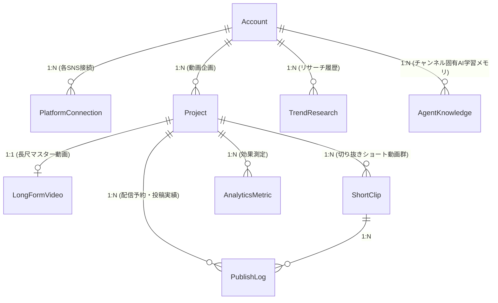

# データモデル設計 (Data Model)

本ドキュメントでは、OmniPulse AI Studio のマルチアカウント対応データベース（SQLite + Prisma ORM）のエンティティ関係（ER）および各テーブルの責務を定義する。

---

## 1. ER図 (Entity-Relationship Diagram)

---

## 2. 各テーブルの責務と主要カラム

### 1. `Account` (チャンネル / ブランドアカウント)
1つの組織・ユーザーが複数の異なるチャンネル（例: 「AI速報スタジオ」「ゼロから始めるITキャリア」）を運用するための最上位エンティティ。
- `id` (String / CUID): 一意キー
- `name` (String): アカウント表示名
- `slug` (String, Unique): URL/識別用スラッグ
- `category` (String): メインカテゴリ（例: `AI・IT`）
- `concept` (String): チャンネルの基本コンセプト
- `targetAudience` (String): ペルソナ・ターゲット層
- `toneOfVoice` (String): トーン＆マナー
- `systemPromptRules` (String?): 台本生成時にAIへ強制適用するルール
- `isActive` (Boolean): 有効フラグ

### 2. `PlatformConnection` (SNS連携情報)
アカウントごとに紐づく各SNSの接続状態とクレデンシャル。
- `id`: 一意キー
- `accountId`: 紐づくAccount
- `platform`: `youtube` | `tiktok` | `instagram` | `x`
- `handle`: アカウント識別子（例: `@ai_pulse_lab`）
- `apiConfig`: トークン等の設定JSON
- `isConnected`: 接続状態フラグ

### 3. `TrendResearch` (トレンドリサーチ履歴)
エージェントが Web 検索で調べた話題（`npm run agent -- trend:add`）。
- `id`: 一意キー
- `accountId`: 対象Account
- `topic`: トレンドトピック名
- `category`: カテゴリ
- `buzzScore`, `searchVolume`, `trendVelocity`: 実測できた場合のみ。推測値は入れず null にする
- `suggestedAngle`: 動画の切り口
- `summary`: 調べて分かった事実の要約
- `sourcesJson`: 出典 `[{ title, url }]`（CLI からの登録では必須）

### 4. `Project` (動画企画プロジェクト)
1つの動画企画のルート。長尺動画と複数の切り抜きショートを束ねる。
- `id`: 一意キー
- `accountId`: 対象Account
- `title`: 企画タイトル
- `concept`: 企画詳細
- `stage`: `research` | `production` | `review` | `published` | `analyzed`
  - `production`: 台本あり・未レンダリング / `review`: レンダリング済み・承認待ち / `published`: 1媒体以上で配信済み / `analyzed`: 実測値で分析済み
- `trendResearchId`: 元になったリサーチ（出典の追跡用、任意）

### 5. `LongFormVideo` (長尺動画マスター)
YouTube向けの横型マスター動画。
- `id`: 一意キー
- `projectId`: 紐づくProject (1:1)
- `title`: 長尺タイトル
- `description`: 概要欄テキスト
- `durationSec`: 総尺（秒）
- `thumbnailUrl`: サムネイル画像URL
- `status`: `drafting` | `rendered` | `approved` | `published`
- `scriptJson`: チャプター分割・ナレーション・ト書きの配列JSON

### 6. `ShortClip` (切り抜きショート動画)
長尺から自動抽出された縦型（9:16）ショート動画。
- `id`: 一意キー
- `projectId`: 紐づくProject (1:N)
- `title`: ショートタイトル
- `startTimeSec`, `endTimeSec`: 切り抜き区間
- `durationSec`: 秒数（30〜60秒）
- `hookSentence`: 冒頭1〜2秒の強力なフックセリフ
- `captionStyle`: テロップスタイル（`dynamic-bounce` 等）
- `aspectRatio`: デフォルト `9:16`
- `estimatedRetentionRate`: 予測視聴維持率（%）
- `scriptJson`: ショートの台本 `[{ text, caption? }]`。1要素 = 読み上げ1行 = 字幕1枚
- `renderedFilePath`: レンダリング済み MP4 の `data/` からの相対パス（例: `projects/<id>/video.mp4`）。`POST /api/publish` はこのファイルを配信する
- `readyToPublish`: 配信対象かどうか

### 7. `PublishLog` (配信ログ & スケジュール)
プラットフォーム別の投稿スケジュールと配信結果。
- `id`: 一意キー
- `projectId`: 紐づくProject
- `shortClipId`: 紐づくShortClip（ショートの場合）
- `platform`: `youtube` | `tiktok` | `instagram` | `x`
- `title`, `caption`, `tagsJson`: プラットフォーム最適化メタデータ
- `status`: `draft` | `scheduled` | `published` | `failed`
- `postUrl`: 投稿後の実URL（API が URL を返した場合、または手動投稿を `publish:record` で記録した場合）
- `externalId`: プラットフォーム側の動画ID（YouTube の videoId 等）。実測値の自動取得に使う
- `errorMessage`: `failed` の理由（認証未設定・APIエラー・未実装）
- `scheduledAt`, `publishedAt`: 予約・公開日時

### 8. `AnalyticsMetric` (アナリティクス実績)
投稿後の効果測定データ。
- `id`: 一意キー
- `projectId`: 紐づくProject
- `platform`: プラットフォーム
- `views`: 再生回数
- `retentionRate`: 視聴維持率（%）。未取得なら null（0 を入れない）
- `likes`, `shares`, `comments`: エンゲージメント数
- `engagementRate`: エンゲージメント率（%）
- `topComment`: 代表的なコメント

### 9. `AgentKnowledge` (CriticAIのチャンネル別学習メモリ)
アナリティクス分析から得られた「このチャンネルでバズる法則」。アカウントごとに独立蓄積される。
- `id`: 一意キー
- `accountId`: 対象Account
- `category`: `hook` | `tempo` | `topic` | `cta`
- `ruleText`: 学習知見ルール
- `confidenceScore`: 信頼度スコア (0.0〜1.0)
- `appliedCount`: 次回企画への適用回数

---

## 3. ストレージと環境
- **DBエンジン**: SQLite (`file:./prisma/dev.db`)
- **スキーマ定義ファイル**: `prisma/schema.prisma`
- **クライアント生成**: `npx prisma generate`（`src/lib/prisma.ts` 経由で呼び出し）
- **クラウド移行性**: `schema.prisma` の `datasource db` を PostgreSQL / Supabase の接続URLに差し替えるだけで、スキーマやモデルコードを1行も変えずにクラウドDBへ移行可能。
