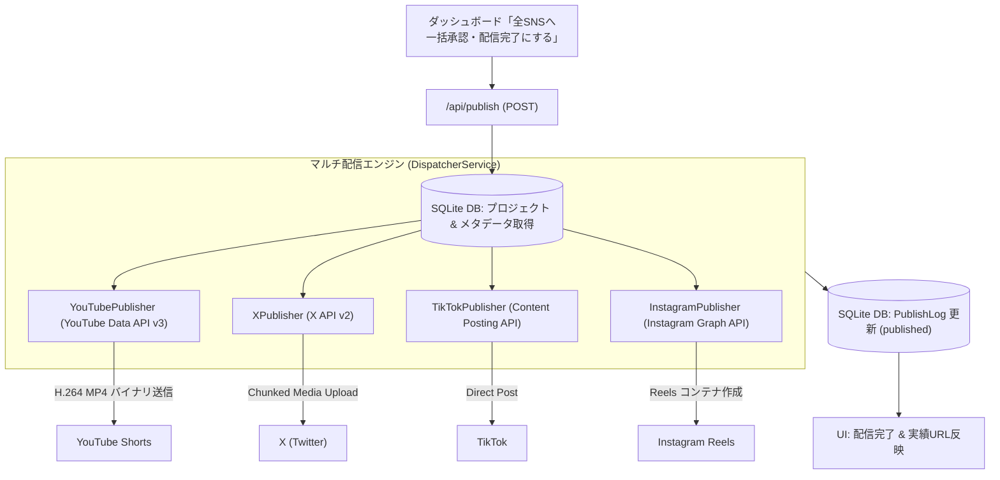

# マルチSNS自動配信パイプライン設計 (Publishing Pipeline)

本ドキュメントでは、OmniPulse AI Studio における「ステップ3: 承認 & マルチSNS自動配信」の技術アーキテクチャおよび各プラットフォームへの直接投稿仕様を定義する。

---

## 1. 配信アーキテクチャ全体像



---

## 2. 実装コンポーネント

| ファイル / エンドポイント | 役割 |
| :--- | :--- |
| **`src/app/api/publish/route.ts`** | 一括配信リクエストを受け取り、`MultiPlatformPublisher` を並列実行してSQLite DBの `PublishLog` テーブルを更新するバックエンドAPI。 |
| **`src/lib/publishers/index.ts`** | 全プラットフォーム（YouTube, TikTok, Instagram, X）への一括並列ディスパッチを統括する集約マネージャー。 |
| **`src/lib/publishers/youtubePublisher.ts`** | Google公式 `googleapis` SDKを使用し、YouTube Data API v3 の `videos.insert` を叩いて動画ファイルを直接アップロードするエンジン。 |
| **`src/lib/publishers/tiktokPublisher.ts`** | TikTok Content Posting API (Direct Post) 経由で動画バイナリのチャンクアップロードを行うエンジン。 |
| **`src/lib/publishers/instagramPublisher.ts`** | Instagram Graph API (Reels Publishing) 経由でコンテナ作成およびメディア公開を行うエンジン。 |
| **`src/lib/publishers/xPublisher.ts`** | X API v2 (Tweets) & Media Upload を経由して動画付きツイートを直接投稿するエンジン。 |
| **`src/components/ApprovalView.tsx`** | 各SNS向けのタイトル・キャプション・タグ編集、動画ファイル保存、ワンクリッククリップボードコピー、一括配信トリガーUI。 |
| **`src/components/SettingsModal.tsx`** | YouTube, TikTok, Instagram, X の4つのプラットフォーム別認証情報を入力・保存するモーダル。 |

---

## 3. 各プラットフォームの設定手順 (OAuth2 / API Key)

全プラットフォームとも、環境変数が未設定の場合は**シミュレーションモードとして安全にフォールバック**し、エラーなくローカル検証が可能です。実アカウントへ直接公開する場合は、以下のクレデンシャルを `.env` またはダッシュボード設定モーダルから登録します。

### 3.1 YouTube Data API v3
- **Google Cloud Console**: YouTube Data API v3 を有効化し、OAuth 2.0 クライアント ID を作成。
- **必要環境変数**:
  ```bash
  YOUTUBE_CLIENT_ID="xxxx.apps.googleusercontent.com"
  YOUTUBE_CLIENT_SECRET="GOCSPX-xxxx"
  YOUTUBE_REFRESH_TOKEN="1//xxxx"
  ```

### 3.2 TikTok Content Posting API (Direct Post)
- **TikTok for Developers**: アプリを作成し、`video.publish` スコープを付与。
- **必要環境変数**:
  ```bash
  TIKTOK_ACCESS_TOKEN="act.xxxx"
  TIKTOK_CREATOR_USERNAME="ai_pulse_lab"
  ```

### 3.3 Instagram Graph API (Reels Publishing)
- **Meta for Developers**: Facebook Login および Instagram Graph API を利用し、プロアカウント（ビジネス/クリエイター）を連携。
- **必要環境変数**:
  ```bash
  INSTAGRAM_BUSINESS_ACCOUNT_ID="17841400000000000"
  INSTAGRAM_ACCESS_TOKEN="EAAGxxxx"
  ```

### 3.4 X (Twitter) API v2
- **X Developer Portal**: プロジェクトを作成し、OAuth 1.0a (User Context: Read and Write) を有効化。
- **必要環境変数**:
  ```bash
  X_API_KEY="xxxx"
  X_API_SECRET="xxxx"
  X_ACCESS_TOKEN="xxxx"
  X_ACCESS_TOKEN_SECRET="xxxx"
  ```

