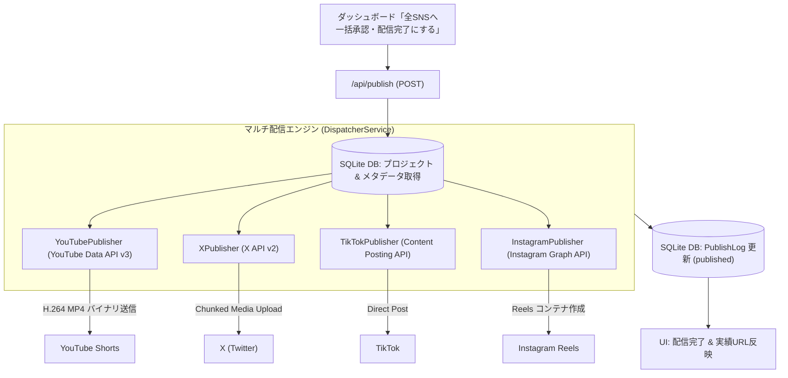

# マルチSNS自動配信パイプライン設計 (Publishing Pipeline)

本ドキュメントでは、OmniPulse AI Studio における「ステップ3: 承認 & マルチSNS自動配信」の技術アーキテクチャおよび各プラットフォームへの直接投稿仕様を定義する。

---

## 1. 配信アーキテクチャ全体像



---

## 2. 実装コンポーネント

| ファイル / エンドポイント | 役割 |
| :--- | :--- |
| **`src/lib/services/publishService.ts`** | 配信の本体。ダッシュボード（`/api/publish`）とエージェント CLI（`npm run agent -- publish`）の両方から呼ぶ。手動投稿の記録（`recordManualPublish`）もここ。 |
| **`src/app/api/publish/route.ts`** | 一括配信リクエストを受け取り、`MultiPlatformPublisher` を並列実行してSQLite DBの `PublishLog` テーブルを更新するバックエンドAPI。 |
| **`src/lib/publishers/index.ts`** | 全プラットフォーム（YouTube, TikTok, Instagram, X）への一括並列ディスパッチを統括する集約マネージャー。 |
| **`src/lib/publishers/youtubePublisher.ts`** | Google公式 `googleapis` SDKを使用し、YouTube Data API v3 の `videos.insert` を叩いて動画ファイルを直接アップロードするエンジン。 |
| **`src/lib/publishers/tiktokPublisher.ts`** | TikTok Content Posting API (Direct Post) 経由で動画バイナリのチャンクアップロードを行うエンジン。 |
| **`src/lib/publishers/instagramPublisher.ts`** | Instagram Graph API (Reels Publishing) 経由でコンテナ作成およびメディア公開を行うエンジン。 |
| **`src/lib/publishers/xPublisher.ts`** | **未実装**。OAuth 1.0a 署名付き chunked media upload + `POST /2/tweets` が必要。実装されるまで常に失敗（`success: false`）を返す。 |
| **`src/components/ApprovalView.tsx`** | 各SNS向けのタイトル・キャプション・タグ編集、動画ファイル保存、ワンクリッククリップボードコピー、一括配信トリガーUI。 |
| **`src/components/SettingsModal.tsx`** | プラットフォーム別認証情報の入力モーダル。**現状は入力値を保存しない**（クレデンシャルは `.env.local` で設定する）。 |

---

## 3. 各プラットフォームの設定手順 (OAuth2 / API Key)

環境変数が未設定のプラットフォームには**投稿せず、失敗（`success: false`, `isSimulated: true`）として返す**。偽の投稿URLは返さない（Decision 009）。実アカウントへ公開する場合は、以下のクレデンシャルを `.env.local` に設定する。

### 3.1 YouTube Data API v3
- **Google Cloud Console**: YouTube Data API v3 を有効化し、OAuth 2.0 クライアント ID を作成。
- **必要環境変数**:
  ```bash
  YOUTUBE_CLIENT_ID="xxxx.apps.googleusercontent.com"
  YOUTUBE_CLIENT_SECRET="GOCSPX-xxxx"
  YOUTUBE_REFRESH_TOKEN="1//xxxx"
  ```

### 3.2 TikTok Content Posting API (Direct Post)
- **TikTok for Developers**: アプリを作成し、`video.publish` スコープを付与。
- **必要環境変数**:
  ```bash
  TIKTOK_ACCESS_TOKEN="act.xxxx"
  ```

### 3.3 Instagram Graph API (Reels Publishing)
- **Meta for Developers**: Facebook Login および Instagram Graph API を利用し、プロアカウント（ビジネス/クリエイター）を連携。
- **必要環境変数**:
  ```bash
  INSTAGRAM_BUSINESS_ACCOUNT_ID="17841400000000000"
  INSTAGRAM_ACCESS_TOKEN="EAAGxxxx"
  ```

### 3.4 X (Twitter) API v2
- **X Developer Portal**: プロジェクトを作成し、OAuth 1.0a (User Context: Read and Write) を有効化。
- **必要環境変数**:
  ```bash
  X_API_KEY="xxxx"
  X_API_SECRET="xxxx"
  X_ACCESS_TOKEN="xxxx"
  X_ACCESS_TOKEN_SECRET="xxxx"
  ```


---

## 4. 配信の処理仕様（`publishService.publishProject`）

ダッシュボードの `POST /api/publish` は4媒体すべてに、CLI の `publish --platforms` は指定した媒体に配信する。

### 4.1 入口チェック
- `Content-Type: application/json` 以外は 415、別オリジン（`Origin` / `Sec-Fetch-Site` 不一致）は 403（`src/lib/requestGuard.ts`）。
- 開発サーバーは `127.0.0.1` にのみバインドする（`npm run dev`）。

### 4.2 配信対象の動画
- プロジェクトの `ShortClip` のうち `readyToPublish = true`（**人間が承認済み**）かつ `renderedFilePath` が設定されたものを配信する。
- `renderedFilePath` は `public/videos/` 配下のファイル名。basename だけを使うため、`public/videos/` の外は指せない。
- 該当クリップが無い、またはファイルが無い場合は 400。

### 4.3 二重投稿の防止
- `PublishLog.status = "published"` のプラットフォームは再送しない。全プラットフォームが配信済みなら 409。
- 失敗したプラットフォームだけを、同じ API で再実行できる。

### 4.4 結果の記録
| 結果 | `PublishLog` | 備考 |
| :--- | :--- | :--- |
| 実投稿に成功 | `status = "published"`, `publishedAt`, `postUrl`, `externalId` | `postUrl` は API が返した実URLのみ。TikTok は `publish_id` しか得られないため空 |
| 認証未設定・API エラー・未実装 | `status = "failed"`, `errorMessage` | |

- `Project.stage` は、1媒体でも `published` になったら `published` に更新する（自動投稿が YouTube のみのため。Decision 010）。全媒体そろったかはレスポンスの `allPublished` で判定する。
- YouTube の公開範囲は既定で `private`（未審査の API プロジェクトは非公開に固定されるため。`docs/operations/youtube-setup.md`）。
- ログの更新は1トランザクションで行う。
- レスポンス: `success`（1件以上成功したか）, `allPublished`, `succeeded`, `failed[{platform, message}]`。

### 4.5 手動投稿の記録
TikTok / Instagram / X は当面ユーザーが手動で投稿する（Decision 010）。`npm run agent -- export:manual` で動画とキャプションを書き出し、投稿後に `publish:record <projectId> <platform> <url>` で `PublishLog` を `published` にする。
