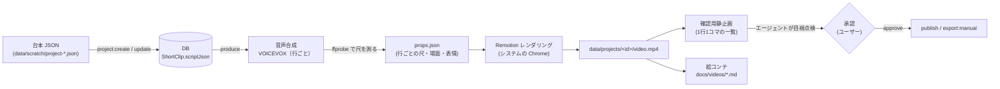

# ショート動画テンプレート設計 (video-template)

エージェント CLI（`npm run agent -- produce`）が作る縦型ショート動画（1080×1920 / 30fps）の構成図と仕様。動画ごとの具体的な構成（絵コンテ）は [../videos/](../videos/README.md) に記録する。

---

## 1. 制作パイプライン



- 台本1行 = 読み上げ1回 = 字幕1枚。行の尺は音声の長さ + 6フレームの間で決まり、動画の尺はその合計 + 末尾20フレーム。
- 場面（scene）を持つ行から、次に場面を持つ行の手前までを1つの区間として描く。区間の途中でアニメーションが途切れない。

## 2. 画面レイアウト

```
 0 ┌──────────────────────────────┐
   │ [ロゴ] ついていくのが精一杯   │  ヘッダー（ブランド名）
   │ ▍ タイトル                    │  タイトル（1行に収まるよう自動縮小）
290├──────────────────────────────┤
   │                              │
   │   ステージ（980×800）         │  場面ごとのアニメーション（白いカード）
   │                              │
   │ (◕‿◕)                        │  マスコット（左下に重ねる。ここには大事な要素を置かない）
1090├──────────────────────────────┤
   │                              │
   │   字幕（強調語は水色＋マーカー）│  1120〜1420
   │                              │
   │ @handle  VOICEVOX:ずんだもん  │  ハンドル・声のクレジット
1440├──────────────────────────────┤
   │                              │
   │ （空き: YouTube Shorts の     │  タイトル・チャンネル名・右側ボタンと
   │   下部 UI が重なる領域）      │  重ならないよう何も置かない
   │                              │
1906│▓▓▓▓▓▓▓▓░░░░░░░░░░░░░░░░░░░░│  進捗バー
1920└──────────────────────────────┘
```

## 3. デザイン方針

- **白と水色を基調にしたシンプルな画面**（2026-10-10 ユーザー指定）。配色は `remotion/theme.ts`。
  - 背景 `#F3F8FC`、カード `#FFFFFF`、水色 `#38BDF8`、強調 `#0284C7`、マーカー `#E0F2FE`、文字 `#0F172A`。
- **絵文字・スタンプは使わず、UI 部品（カード・チップ・ステップ・選択UI・チャット画面の再現）で表現する**（同上）。
- チャット画面は特定サービスの UI を使わない汎用の再現にし、「※イメージ」と表示する（実際の画面と誤解させないため）。
- 字幕は、台本の `\n` 区切りの最長行が1行に収まる文字サイズを自動で計算する（意図しない位置での折り返しを防ぐ）。
- BGM は使わない（2026-10-10 ユーザー判断）。行の切り替えに短い効果音（`public/se/`、ffmpeg で生成した自作音源）を入れる。

## 4. 場面の種類（`remotion/types.ts` の `Scene`）

| type | 用途 | 主な項目 |
| :--- | :--- | :--- |
| `hook` | 冒頭のつかみ | `text`, `sub`（バッジ） |
| `keyword` | 要点を1つ大きく見せる | `text`, `label` |
| `compare` | Before / After の比較 | `left`, `right`（`label`, `body`） |
| `chat` | チャット画面の再現 | `user`（質問）, `reply`（`text` / `table` / `bill` / `chart` / `calculator`） |
| `timeline` | 日付・手順が順に進む | `title`, `steps`（`label`, `detail`） |
| `chips` | できることを並べる | `title`, `items` |
| `select` | 選択肢を AI が自動で選ぶ | `title`, `options`, `selected` |
| `outro` | 締め（ロゴ・チャンネル名） | `text` |

マスコットの表情（`mood`）: `panic`（＞＜・汗）/ `surprised`（驚き）/ `happy` / `think`（汗）/ `nod`。声の大きさに合わせて口が動く。省略した行は直前の表情を引き継ぐ。

## 5. 声

- VOICEVOX（ローカル、`~/.local/share/voicevox/macos-arm64/run`）。`produce` が未起動なら自動で起動・停止する。
- 既定は **ずんだもん（ノーマル）・速度 1.15**（2026-10-10 ユーザー選択）。`--voice` / `AGENT_VOICE` で変更できる。
- **クレジット「VOICEVOX:ずんだもん」を動画内と投稿文（X 以外）に必ず入れる**（[ずんだもん音源利用ガイドライン](https://zunko.jp/con_ongen_kiyaku.html)。クレジットなしの商用利用は有償契約）。
- 同ガイドラインの禁止事項に、**特定の個人・団体を非難・批判、または応援する目的での利用**、意図的に誤解を招く内容がある。台本で特定企業を持ち上げたり叩いたりしない。事実の紹介に留める。

## 6. 関連ファイル

| ファイル | 役割 |
| :--- | :--- |
| `remotion/ShortVideo.tsx` | 全体の構成（背景・ヘッダー・ステージ・字幕・マスコット・音） |
| `remotion/components/Scenes.tsx` | 場面の UI |
| `remotion/components/Caption.tsx` | 字幕（強調語） |
| `remotion/components/Mascot.tsx` | マスコット（表情・口パク） |
| `remotion/theme.ts` | 配色・フォント・文字サイズ計算 |
| `agent/produce.ts` | 音声合成 → レンダリング → 確認用静止画 |
| `agent/tts.ts` | VOICEVOX / edge-tts |
| `agent/cli.ts` | `produce` / `storyboard` など |
