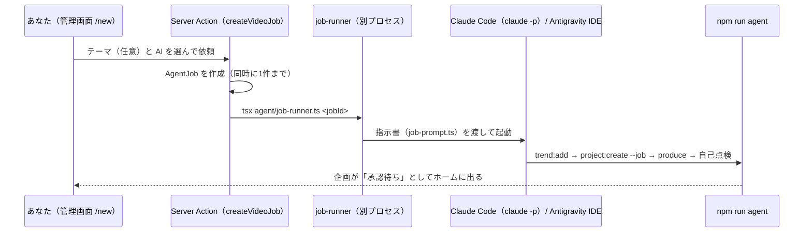

# 管理画面（ダッシュボード）UI 要件

管理画面（`http://127.0.0.1:3001`）の作り直しに向けて、ユーザーと合意した要件。2026-10-10 に要件定義を完了。

---

## 1. 目的

- 一連の流れ（リサーチ → 台本 → 制作 → 承認 → 配信 → 計測 → 分析）を、画面上で迷わず進められるようにする。
- 「あなた（ユーザー）の番」と「エージェントの番」が一目で分かるようにする。

## 2. 現状の問題（2026-10-10 確認）

- 画面の構成が実際の流れと合っていない。「長尺 & 切り抜き」「AI自動切り抜き」など、存在しない工程が表示される。
- 次に何をすればいいかが分からない。
- 動かない、または誤解を招くボタンがある。
  - 「自律リサーチを実行」: 未実装
  - 「承認制モード」切り替え: Auto-Pilot は未実装
  - 設定（APIキー）: 何も保存しない
- 承認に必要な動画・絵コンテを画面で見られない。

## 3. 確定した要件

### 3.1 画面の骨組み
- 左上にハンバーガーメニュー（≡）を置き、左側に画面一覧（サイドメニュー）を出す。開閉できる。スマホ幅ではメニューが画面の上に重なって表示される。
- サイドメニューの最上部に**チャンネル切り替え**を置き、他の画面はすべて選択中のチャンネル単位で表示する。
  - 理由: コンセプト・口調・SNS・リサーチ・知見がチャンネルごとに分かれており、混ぜると別チャンネルの知見や口調が台本に混入するため。
- 例外として、**ホームの「あなたの番」（やることリスト）は全チャンネル横断**で表示し、各項目にチャンネル名を付ける。

### 3.2 画面一覧（案）

| 画面 | 内容 | 範囲 |
| :--- | :--- | :--- |
| ホーム | あなたの番（承認・投稿・URL 記録・数字入力など）、進行中の企画の工程 | 全チャンネル横断 |
| 新しい動画を作る | テーマ（任意）と実行する AI を選んで依頼する。依頼後は進み具合を表示する | チャンネル |
| 企画 | 工程ボード / 一覧 → 詳細（動画の再生、絵コンテ、出典、投稿文、承認、YouTube 投稿、手動投稿、数字入力、分析） | チャンネル |
| リサーチ | 登録済みの話題と出典 | チャンネル |
| 分析・知見 | 実測値と蓄積された知見 | チャンネル |
| チャンネル設定 | コンセプト・口調・SNS アカウント | チャンネル |
| 使い方 | 1本の動画が公開されるまでの流れと、誰が何をするか | 共通 |
| 設定 | 保存しているファイルの容量と、古い生成物の整理（ルール・自動整理・今すぐ実行） | 共通 |

### 3.3 配色
- 次の2つを切り替えられるようにする。切り替えボタンは画面の右上。
  - **ライト: 白と水色**
  - **ダーク: 黒とオレンジ**（オレンジはチャンネルアイコンの黄色〜オレンジ系に合わせる）
- 既定は **OS（Mac）の設定に合わせる**。ユーザーが切り替えたら、その選択を記憶する。
- 管理画面の配色は、動画の配色（Decision 011: 白と水色）とは**無関係**。

### 3.4 動画づくりの依頼
- 動画づくり（リサーチ → 台本 → 制作 → 自己点検）は、**管理画面から依頼できる**ようにする。
- 依頼を受けて動く AI は、**Claude Code** と **Antigravity（Gemini）** から選べるようにする。将来は AI API に移行する。
  - Claude Code: `claude -p` で画面なしで最後まで自動実行し、実行ログを画面に表示する。使えるツールは Web 検索と `npm run agent` に限定し、書き込みも作業用フォルダ内に限定する。
  - Antigravity: `antigravity-ide chat -m agent` で、IDE のチャットに依頼を送る。途中経過は IDE で見る。操作の許可は IDE 上でユーザーが行う。
  - どちらの AI でも、依頼（ジョブ）を DB で管理し、共通の指示書を渡す。AI は承認の手前で止まる。AI API への移行時は、実行役を追加するだけで済む構造にする。
- 承認は人間が行う（Decision 002 / 010）。

### 3.5 YouTube への投稿
- 承認後、画面のボタンで YouTube に投稿する（非公開）。公開への切り替えは YouTube Studio で行う。

### 3.6 全体方針: シンプル is best
- 画面・機能・文言は最小限にする。1画面1目的。迷わせる装飾、使わない数値、動かないボタンは置かない。
- 実装もシンプルにする。読み取りはサーバーコンポーネントで DB を直接読み、書き込みは Server Actions で行う。

### 3.7 追加要件（2026-10-10）
- **アカウント（チャンネル）を複数持てるようにする**。画面名は「チャンネル設定」から **「アカウント」** に変える。アカウントの一覧・追加・編集ができる。
  - アカウントごとに別の YouTube チャンネルへ投稿する前提。YouTube の認証情報はアカウントごとに分け、投稿の直前に「認証先のチャンネル = 登録したチャンネル」を確認し、違えば投稿しない（別チャンネルへの誤投稿を防ぐ）。
- **作成した動画の一覧画面**（「動画」）: 作った動画をサムネイルで並べ、状態・再生数・YouTube へのリンクを表示する。
- **作業中のタスクをリアルタイムに確認する画面**（「作業状況」）: 作業中の依頼の工程（リサーチ → 登録 → 台本 → 制作 → 点検）と作業の記録を、数秒ごとに更新して表示する。最近終わった依頼も出す。

### 段階4: 追加要件（2026-10-10 実装）

| URL | 内容 |
| :--- | :--- |
| `/accounts` | アカウント一覧（YouTube 連携の状態、企画数）。「アカウントを追加」 |
| `/accounts/new` | アカウントの追加（名前・ID・カテゴリ・コンセプト・視聴者・話し方・台本のルール・YouTube ハンドル）。追加したアカウントに切り替わる |
| `/accounts/[slug]` | 設定の編集と YouTube 連携。「YouTube と連携する」（連携済みなら「連携し直す」）で Google の許可画面に移り、戻ると結果を表示する |
| `/videos` | 選択中アカウントの動画一覧（1秒目のコマをサムネイルに、状態・尺・再生数・YouTube へのリンク） |
| `/activity` | 作業状況。作業中の依頼（全アカウント横断）の工程（リサーチ → 登録 → 台本 → 制作 → 点検）と作業の記録を2秒ごとに更新。最近の依頼10件 |

- 旧「チャンネル設定」（`/settings`）は「アカウント」に置き換えた。`/settings` は、のちにサービス全体の「設定」（生成物の整理）として使っている。
- メニューの「作業状況」に作業中の件数を出す。
- 工程の推定（`src/lib/jobs.ts` の `jobProgress`）は、作業の記録のツール呼び出しから行う（検索・閲覧 → `trend:add` → `project:create` / `update` → `produce` → 確認用静止画の読み取り）。

### 3.8 全体方針: 運用はサービス内で完結させる（2026-10-10）
- 運用に必要な操作（設定・実行）は、すべて管理画面でできるようにする。**管理画面でできないことを IDE やターミナルから実行させない。**
- CLI（`npm run agent`）は、依頼で動くエージェントが使う道具。人の操作の手段としては案内しない。
- 第1弾: 生成物の整理を CLI から「設定」画面に移した（`/settings`）。
- 第2弾: YouTube 連携を CLI（`npm run youtube:auth`）からアカウント画面のボタンに移し、OAuth クライアントの ID・シークレットを「設定」画面で保存できるようにした。

## 4. 未決事項

- なし

## 5. 実装状況

### 段階1: 画面の作り直し（2026-10-10 完了）

| URL | ファイル | 内容 |
| :--- | :--- | :--- |
| `/` | `src/app/page.tsx` | あなたの番（今すぐ）/ あとでやること（計測の期限待ち）/ エージェントの番。全チャンネル横断 |
| `/new` | `src/app/new/page.tsx` | 依頼の仕方の案内（段階2で依頼フォームにする） |
| `/projects` | `src/app/projects/page.tsx` | 企画一覧（工程の帯・担当・次にやること） |
| `/projects/[id]` | `src/app/projects/[id]/page.tsx` | 1. 動画の確認と承認 → 2. SNS 投稿（YouTube ボタン、投稿文コピー、動画ダウンロード、URL 記録）→ 3. 数字の入力と分析 → 台本 → 出典。未配信なら削除できる |
| `/research` | `src/app/research/page.tsx` | リサーチと出典 |
| `/insights` | `src/app/insights/page.tsx` | 動画ごとの数字と知見 |
| `/settings` | `src/app/settings/page.tsx` | チャンネル情報と SNS アカウント（表示のみ。変更はエージェントに依頼） |
| `/guide` | `src/app/guide/page.tsx` | 流れと担当 |

- 工程の判定（次に誰が何をするか）は `src/lib/workflow.ts` に1つだけ置き、管理画面とエージェント CLI（`status`）で共用する。工程は「台本 → 制作 → 承認 → 配信 → 計測・分析」の5つ。計測は最初の投稿から24時間後に「あなたの番」に出る。
- 操作は `src/app/actions.ts`（Server Actions）。数字を保存すると、自動で分析し、知見を保存する。
- 選択中のチャンネルは cookie（`channel`）に持つ。
- 配色は `src/app/globals.css` の CSS 変数。`<html data-theme>` を、`layout.tsx` の inline script が保存済みの選択または OS の設定から描画前に決める。
- 本プロジェクトは Cache Components が有効（`next.config.ts`）。cookie・DB・`usePathname` を使う部分は `<Suspense>` の内側に置く必要がある。
- 撤去したもの: 旧ダッシュボード部品（`src/components/*`）、ダミーデータ（`mockData` / `agentService`）、旧 API（`/api/accounts`, `/api/projects`）、Auto-Pilot スイッチ、保存されない設定モーダル、偽のログ表示。

### 段階2・3: 画面からの動画づくりの依頼（2026-10-10 実装）

- **依頼（AgentJob）**: DB で管理し、AI が `project:create --job <jobId>` で作った企画と紐づける。状態は 作業中 / 完了 / 失敗 / 中止。
- **指示書**: `agent/job-prompt.ts`。runbook の手順 1〜4（リサーチ → 登録 → 台本 → 制作 → 自己点検）と、守るべきルール。依頼ごとの作業フォルダ `data/jobs/<jobId>/` に `prompt.md` と台本の実例 `example-project.json`（`agent/examples/` からコピー）を置く。
- **Claude Code**: `claude -p ... --output-format stream-json --permission-mode dontAsk`。出力を `log.jsonl` に書き、画面（`/jobs/[id]`）が3秒ごとに読み直して表示する。
  - 許可するのは Web 検索・Web 閲覧と、`npm run agent` の `status` / `knowledge` / `trend:add` / `project:create` / `project:update` / `produce` / `storyboard` だけ。
  - 読み書きは作業フォルダと `data/` に限定する（`Read(./**)`, `Edit(./**)`, `Read(//…/data/**)`, `Edit(//…/data/**)`）。単に `Write` / `Read` と許可すると場所を問わず許可され、`.env.local` も読めてしまうことを実測で確認したため。
  - 環境変数 `AGENT_JOB_ID` を渡す。CLI はこれがあると、承認・投稿・数字の記録・分析を拒否する（指示書と権限設定に加えた三重目の安全装置）。
  - 「動画が作られないまま終了」「終了コードが0以外」は失敗にする。
- **Antigravity**: `antigravity-ide chat -m agent -r <指示書>` で IDE のチャットに送る。画面なしの実行・完了待ちはできないため、紐づいた企画の動画ができたら完了とみなす。ツールの制限や `AGENT_JOB_ID` による拒否は効かない。IDE 側の許可と指示書が頼り。
- 中止: 画面の「依頼を中止する」で、Claude Code のプロセスを止める。
- **当面は YouTube のみで検証する**（Decision 012）。企画詳細の投稿・計測は YouTube だけを表示する（`ENABLED_PLATFORMS`）。
