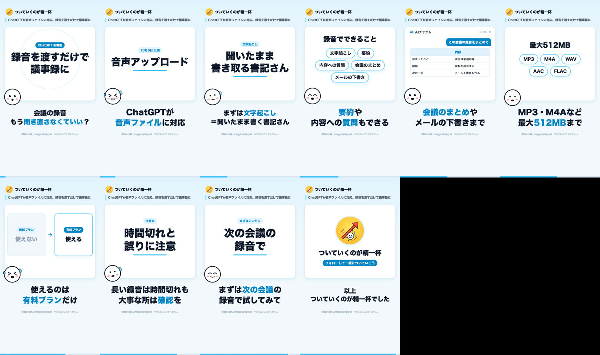

# 絵コンテ: ChatGPTが音声ファイルに対応。録音を渡すだけで議事録に

- プロジェクトID: `cmv1sgspk0001qcphhfmfl44h`
- 状態: published
- 尺: 43.0 秒（10 行）
- 動画ファイル: `data/projects/cmv1sgspk0001qcphhfmfl44h/video.mp4`（Git 管理外）
- 声: VOICEVOX:ずんだもん
- 狙い: ChatGPT の音声アップロードを「録音を渡すだけで、文字起こし・要約・議事録・メール下書きまで」の一言で伝え、有料プラン限定・長い録音や誤りの注意点も添えて、次の会議から試せるようにする

## 構成

| # | 時間 | 場面 | 表情 | 字幕 | 読み上げ |
| :-- | :-- | :-- | :-- | :-- | :-- |
| 1 | 0.0s–3.9s | フック「録音を渡すだけで 議事録に」＋バッジ「ChatGPT 新機能」 | surprised | 会議の録音 もう聞き直さなくていい？ | 会議の録音、もう聞き直さなくていいかもしれません。 |
| 2 | 3.9s–8.5s | キーワード「音声アップロード」（10月6日 公開） | panic | ChatGPTが 音声ファイルに対応 | チャットジーピーティーが、音声ファイルのアップロードに対応しました。 |
| 3 | 8.5s–14.1s | キーワード「聞いたまま 書き取る書記さん」（文字起こし） | think | まずは文字起こし ＝聞いたまま書く書記さん | 録音を渡すと、まず文字起こし。いわば、聞いたまま書き取る書記さんです。 |
| 4 | 14.1s–18.4s | チップ 文字起こし / 要約 / 内容への質問 / 会議のまとめ / メールの下書き | happy | 要約や 内容への質問もできる | さらに、要約や、内容についての質問もできます。 |
| 5 | 18.4s–22.1s | チャット再現「この会議の録音をまとめて」→ 表 | surprised | 会議のまとめや メールの下書きまで | 会議のまとめや、メールの下書きまで作れます。 |
| 6 | 22.1s–26.6s | チップ MP3 / M4A / WAV / AAC / FLAC | nod | MP3・M4Aなど 最大512MBまで | エムピースリーなどに対応で、最大512メガバイトまで。 |
| 7 | 26.6s–29.8s | 比較「無料プラン: 使えない」→「有料プラン: 使える」 | panic | 使えるのは 有料プランだけ | ただし、使えるのは有料プランだけです。 |
| 8 | 29.8s–36.1s | キーワード「時間切れと 誤りに注意」（注意点） | think | 長い録音は時間切れも 大事な所は確認を | 長い録音は時間切れになることも。誤りも混じるので、大事なところは確認を。 |
| 9 | 36.1s–39.9s | キーワード「次の会議の 録音で」（まずはここから） | happy | まずは次の会議の 録音で試してみて | まずは次の会議の録音で、試してみてください。 |
| 10 | 39.9s–43.0s | 締め「フォローして一緒についていこう」 | panic | 以上 ついていくのが精一杯でした | 以上、ついていくのが精一杯でした。 |

## 全行のコマ

## 出典

- [OpenAI Help Center「Uploading files and audio to ChatGPT」](https://help.openai.com/en/articles/8555545-uploading-files-and-audio-to-chatgpt)
- [OpenAI Help Center「ChatGPT release notes」](https://help.openai.com/en/articles/6825453-chatgpt-release-notes)
- [Impress Watch「ChatGPT、音声アップロードに対応 文字起こし・要約が可能に」](https://www.watch.impress.co.jp/docs/news/2147136.html)
- [ITmedia AI+「ChatGPT、ついに音声ファイルに対応 文字起こしや要約などが可能に 有料ユーザー向け」](https://www.itmedia.co.jp/aiplus/article/2610/09/2000002182/)

## 配信

| 媒体 | 状態 | URL |
| :-- | :-- | :-- |
| youtube | published | https://youtube.com/shorts/nbuiuu5OtJs |
| tiktok | draft |  |
| instagram | draft |  |
| x | draft |  |
