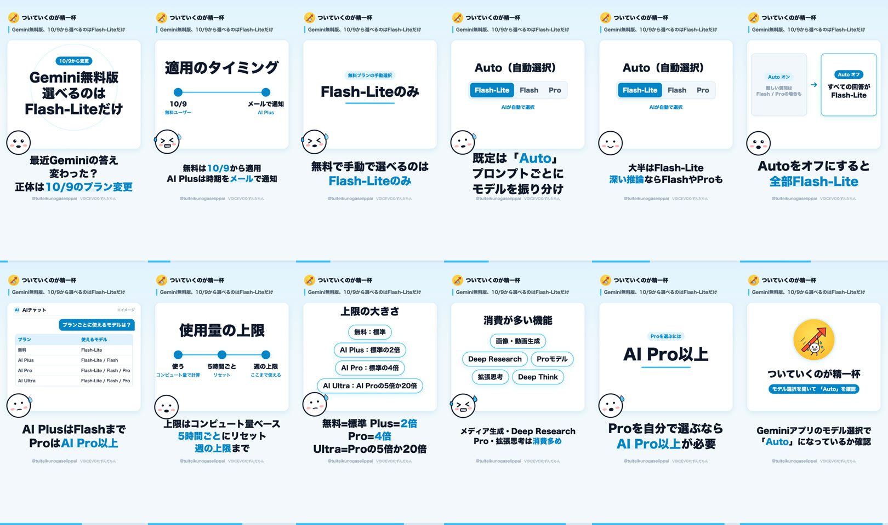

# 絵コンテ: Gemini無料版、10/9から選べるのはFlash-Liteだけ

- プロジェクトID: `cmv2qice30001qc4hzd5fao3v`
- 状態: published
- 尺: 71.2 秒（12 行）
- 動画ファイル: `data/projects/cmv2qice30001qc4hzd5fao3v/video.mp4`（Git 管理外）
- 声: VOICEVOX:ずんだもん
- 狙い: 「最近Geminiの答えが変わった？」の正体は10月9日のプラン変更で、無料・AI Plus・AI Proで使えるモデルと上限、Autoの仕組みを30秒で整理する。

## 構成

| # | 時間 | 場面 | 表情 | 字幕 | 読み上げ |
| :-- | :-- | :-- | :-- | :-- | :-- |
| 1 | 0.0s–6.3s | フック「Gemini無料版 選べるのは Flash-Liteだけ」＋バッジ「10/9から変更」 | surprised | 最近Geminiの答え 変わった？ 正体は10/9のプラン変更 | 最近ジェミニの答え、変わった気がしない？正体は10月9日のプラン変更です。 |
| 2 | 6.3s–13.9s | ステップ 10/9(無料ユーザー) → メールで通知(AI Plus) | panic | 無料は10/9から適用 AI Plusは時期をメールで通知 | 無料ユーザーは10月9日から適用開始。エーアイプラスは、いつ適用されるかがメールで届きます。 |
| 3 | 13.9s–18.6s | キーワード「Flash-Liteのみ」（無料プランの手動選択） | panic | 無料で手動で選べるのは Flash-Liteのみ | 無料プランで手動で選べるモデルは、フラッシュライトだけになりました。 |
| 4 | 18.6s–23.7s | 選択UI Flash-Lite / Flash / Pro | think | 既定は「Auto」 プロンプトごとに モデルを振り分け | ただ既定はオート。プロンプトごとに、ジェミニが合うモデルへ振り分けます。 |
| 5 | 23.7s–31.1s | （前の場面を継続） | nod | 大半はFlash-Lite 深い推論ならFlashやProも | ほとんどは最速のフラッシュライト行き。深い推論が要る質問だけ、フラッシュやプロに回ることがあります。 |
| 6 | 31.1s–36.4s | 比較「Auto オン: 難しい質問は Flash / Proの場合も」→「Auto オフ: すべての回答が Flash-Lite」 | surprised | Autoをオフにすると 全部Flash-Lite | ここが分かれ目。オートを切ると、無料の回答は全部フラッシュライトです。 |
| 7 | 36.4s–42.0s | チャット再現「プランごとに使えるモデルは？」→ 表 | think | AI PlusはFlashまで ProはAI Pro以上 | プラン別だとこう。エーアイプラスはフラッシュまで、プロはエーアイプロ以上です。 |
| 8 | 42.0s–48.2s | ステップ 使う(コンピュート量で計算) → 5時間ごと(リセット) → 週の上限(ここまで使える) | nod | 上限はコンピュート量ベース 5時間ごとにリセット 週の上限まで | 上限はコンピュート量ベース。5時間ごとにリセットされ、週の上限まで使えます。 |
| 9 | 48.2s–55.2s | チップ 無料：標準 / AI Plus：標準の2倍 / AI Pro：標準の4倍 / AI Ultra：AI Proの5倍か20倍 | think | 無料=標準 Plus=2倍 Pro=4倍 Ultra=Proの5倍か20倍 | 大きさは無料が標準、プラスが2倍、プロが4倍、ウルトラはプロの5倍か20倍。 |
| 10 | 55.2s–61.5s | チップ 画像・動画生成 / Deep Research / Proモデル / 拡張思考 / Deep Think | panic | メディア生成・Deep Research Pro・拡張思考は消費多め | 画像や動画の生成、ディープリサーチ、プロ、拡張思考は消費が多めです。 |
| 11 | 61.5s–66.2s | キーワード「AI Pro以上」（Proを選ぶには） | think | Proを自分で選ぶなら AI Pro以上が必要 | プロを自分で選んで使いたいなら、エーアイプロ以上が必要です。 |
| 12 | 66.2s–71.2s | 締め「モデル選択を開いて 「Auto」を確認」 | happy | Geminiアプリのモデル選択で 「Auto」になっているか確認 | ジェミニアプリのモデル選択を開いて、オートが選ばれているか確かめよう。 |

## 全行のコマ

## 出典

- [Changes to Gemini model access and limits - Gemini Apps Help（Google 公式ヘルプ・英語）](https://support.google.com/gemini/answer/17004136?hl=en)
- [Gemini モデルへのアクセスと使用量上限の変更 - Gemini アプリ ヘルプ（Google 公式ヘルプ・日本語）](https://support.google.com/gemini/answer/17004136?hl=ja)
- [Gemini Apps limits & upgrades for Google AI subscribers - Gemini Apps Help（Google 公式ヘルプ）](https://support.google.com/gemini/answer/16275805?hl=en)
- [Free Gemini Accounts Are Losing Flash Model Access（AndroidHeadlines）](https://www.androidheadlines.com/2026/10/google-cuts-gemini-ai-model-access-free-ai-plus-tiers-changes.html)
- [Gemini無料版が10月9日からモデル制限、Flash-Liteのみに（X トレンド）](https://x.com/i/trending/2107004434626625645)

## 配信

| 媒体 | 状態 | URL |
| :-- | :-- | :-- |
| youtube | published | https://youtube.com/shorts/hDBsMYFr2vY |
| tiktok | draft |  |
| instagram | draft |  |
| x | draft |  |
