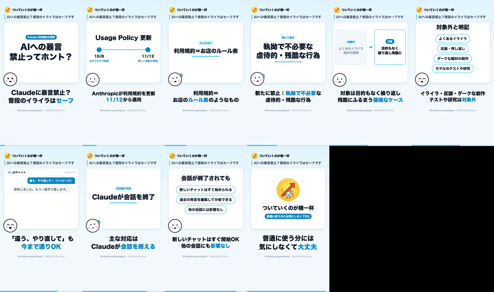

# 絵コンテ: AIへの暴言禁止？普段のイライラはセーフです

- プロジェクトID: `cmv2udhf00001qcw2vix764ut`
- 状態: published
- 尺: 45.7 秒（10 行）
- 動画ファイル: `data/projects/cmv2udhf00001qcw2vix764ut/video.mp4`（Git 管理外）
- 声: VOICEVOX:ずんだもん
- 狙い: Anthropicの利用規約更新で禁止されるのは「目的もなく繰り返しClaudeに残酷にふるまう」極端なケースだけで、普段のイライラや強めの指摘は今まで通りOKだと線引きを伝える。

## 構成

| # | 時間 | 場面 | 表情 | 字幕 | 読み上げ |
| :-- | :-- | :-- | :-- | :-- | :-- |
| 1 | 0.0s–4.6s | フック「AIへの暴言 禁止ってホント？」＋バッジ「Claude 利用規約の更新」 | surprised | Claudeに暴言禁止？ 普段のイライラはセーフ | クロードに暴言禁止って話題ですが、普段のイライラはセーフです。 |
| 2 | 4.6s–9.9s | ステップ 10/8(公式ブログで発表) → 11/12(新しい規約が発効) | nod | Anthropicが利用規約を更新 11/12から適用 | アンソロピックが利用規約を更新、11月12日から適用です。 |
| 3 | 9.9s–13.7s | キーワード「利用規約＝お店のルール表」（たとえると） | think | 利用規約＝ お店のルール表のようなもの | 利用規約は、いわばお店のルール表みたいなもの。 |
| 4 | 13.7s–18.7s | キーワード「執拗で不必要な 虐待的・残酷な行為」（新しく禁止） | think | 新たに禁止：執拗で不必要な 虐待的・残酷な行為 | 新たに禁止されるのは、執拗で不必要な虐待や残酷な行為。 |
| 5 | 18.7s–23.8s | 比較「対象外: よくあるイライラ 強めの指摘」→「対象: 目的もなく 繰り返し残酷に」 | nod | 対象は目的もなく繰り返し 残酷にふるまう極端なケース | 対象は、目的もなく繰り返し残酷にふるまう極端なケースだけ。 |
| 6 | 23.8s–29.5s | チップ よくあるイライラ / 反論・押し返し / ダークな題材の創作 / モデルのテストや研究 | happy | イライラ・反論・ダークな創作 テストや研究は対象外 | イライラ、反論、ダークな創作、テストや研究は対象外と明記。 |
| 7 | 29.5s–34.1s | チャット再現「違う、やり直して！（※イメージ）」→ 文章 | happy | 「違う、やり直して」も 今まで通りOK | 違う、やり直して、と強めに言うのも今まで通りオーケー。 |
| 8 | 34.1s–37.8s | キーワード「Claudeが会話を終了」（主な執行手段） | think | 主な対応は Claudeが会話を終える | 主な対応は、クロード自身が会話を終えること。 |
| 9 | 37.8s–42.2s | チップ 新しいチャットはすぐ始められる / 過去の発言を編集して分岐できる / 他の会話には影響なし | nod | 新しいチャットはすぐ開始OK 他の会話にも影響なし | 新しいチャットはすぐ始められて、他の会話にも影響なし。 |
| 10 | 42.2s–45.7s | 締め「普通に使う分には気にしなくてOK」 | happy | 普通に使う分には 気にしなくて大丈夫 | 普通に使う分には、気にしなくて大丈夫です。 |

## 全行のコマ

## 出典

- [2026 Usage Policy update（Anthropic 公式ブログ, 2026年10月8日）](https://www.anthropic.com/news/2026-usage-policy-update)
- [Usage Policy（Anthropic 公式, 2026年11月12日発効）](https://www.anthropic.com/legal/aup)
- [Claude Opus 4 and 4.1 can now end a rare subset of conversations（Anthropic 公式, 2025年8月15日）](https://www.anthropic.com/research/end-subset-conversations)
- [Anthropic Says Users Can't Be Needlessly Cruel to Claude（MacRumors, 2026年10月8日）](https://www.macrumors.com/2026/10/08/anthropic-user-guideline-update/)
- [Andrew Curran の X 投稿（発効日の告知の引用）](https://x.com/AndrewCurran_/status/2108244808494154089)

## 配信

| 媒体 | 状態 | URL |
| :-- | :-- | :-- |
| youtube | published | https://youtube.com/shorts/Z86TCY7LaoI |
| tiktok | draft |  |
| instagram | draft |  |
| x | draft |  |
